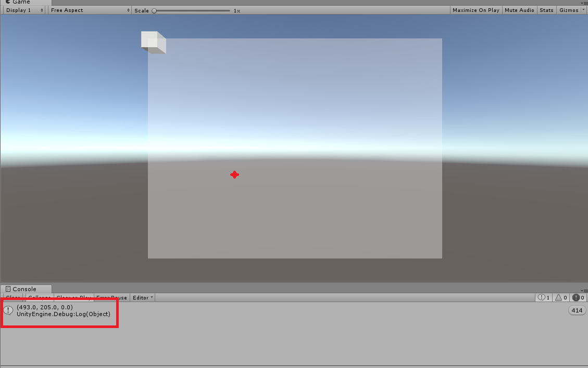

# 关于Unity中位置变化的总结
> 下面是我个人的理解 如果有什么问题欢迎指出

## 坐标系
首先需要明白的三个坐标系
* 屏幕坐标系(Screen)
* 视口坐标系(Viewport)
* 世界坐标系(World)

### 屏幕坐标系
#### 对于屏幕坐标系，首先我们需要明确的一点是，屏幕坐标系的取值范围，或者说它的数值是怎么定义的。
关于这点我们首先来看一下鼠标的位置信息，首先我们将它打印出来，如下图所示

