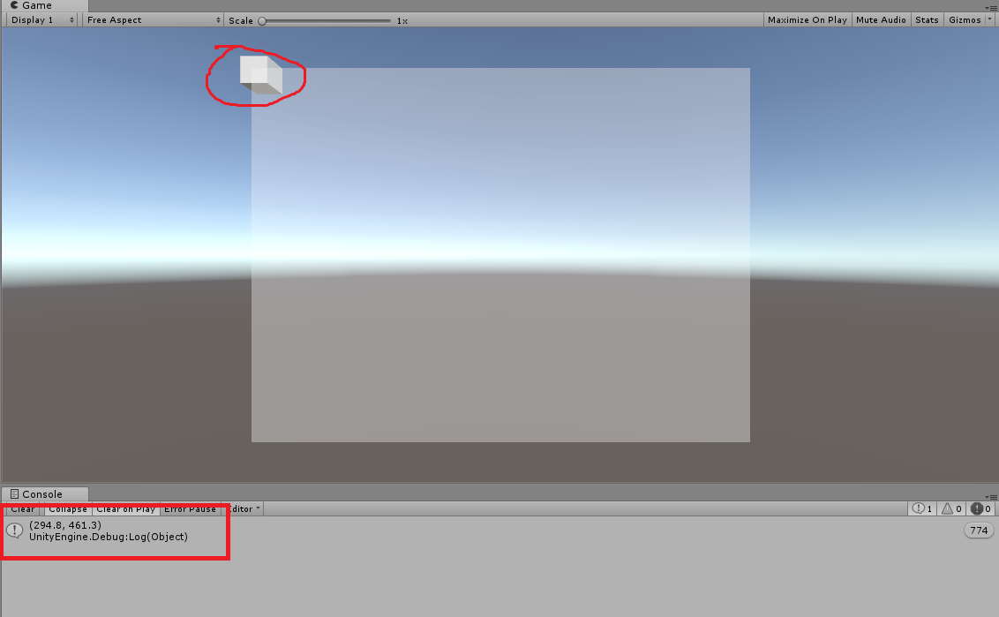
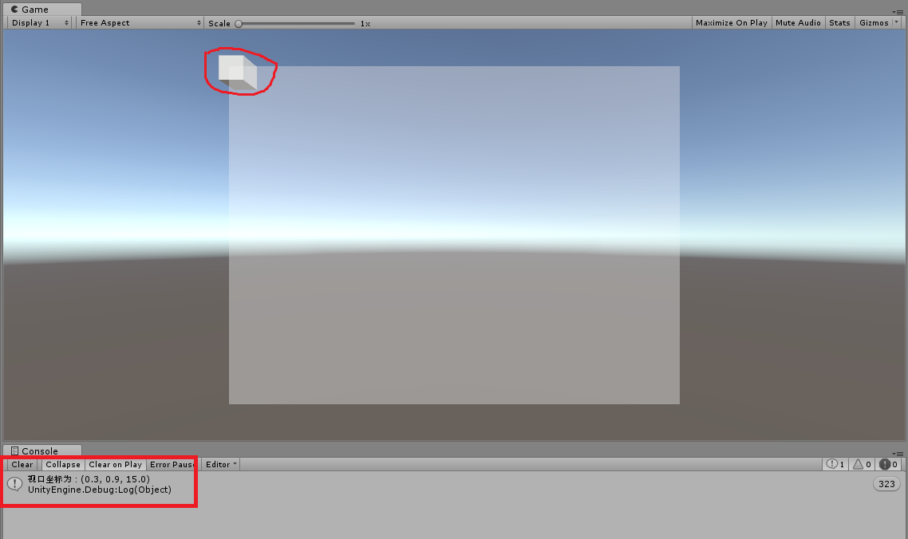

# 关于Unity中位置变化的总结
> 下面是我个人的理解 如果有什么问题欢迎指出

## 坐标系
首先需要明白的三个坐标系
* 屏幕坐标系(Screen)
* 视口坐标系(Viewport)
* 世界坐标系(World)

### 屏幕坐标系(Screen)
#### 对于屏幕坐标系，首先我们需要明确的一点是，屏幕坐标系的取值范围，或者说它的数值是怎么定义的。
关于这点我们首先来看一下鼠标的位置信息，首先我们将它打印出来，如下图所示,由下图不难看出结果，从（493.0，205.0，0.0）中我们可以得出如下几个结论：
* 鼠标的位置坐标是按照屏幕像素点的坐标计算的
* 鼠标位置坐标默认只保留到小数点最后一位

在测试中我发现当鼠标点超出Game视图之后，它的坐标值也存在，只不过的是当超出左边框和下边框时候，它的值就变成负值（其实说这么多，最后你会发现鼠标的坐标位置是从屏幕坐标得出来的结果，这里只是假设不不知道的情况下）
```C#
Debug.Log(Input.mousePosition);
```
<div align="center">

</div>

接下来再来看看一个三维物体的世界坐标转换到屏幕坐标的结果，如下图代码部分，从下图中可以看出，打印出来的数值形式和上面一致。

**综上所述，屏幕坐标系就是以屏幕像素点来作为单位的，默认保留小数点后一位，且屏幕坐标系的原点是左下角，范围内的最大值点是右上角**

```C#
//二维向量
pos_W_S = Camera.main.WorldToScreenPoint(transform.position);
Debug.Log(pos_W_S);
```
<div align="center">

</div>

### 视口坐标系(Viewport)
#### 世界坐标转视口坐标
> 视口坐标系，顾名思义就是我们相机的视口范围中的坐标系，三维相机其实是一个视锥体

从下图中可以看出，视口坐标系是一个三维的向量，它其实是代表一个物体相对于我们相机的视锥体的位置，如果在视锥体中，也就是相机能够看到这个物体的话，那么这个物体的视口坐标的x,y的值就是在0——1之间，z的值根据世界坐标系计算得出，如果相机看不到物体的话，那么它的x,y值将超出0——1的范围。

**视锥体坐标系是以我们当前相机的局部坐标系为准的，类比屏幕坐标系，视口坐标系，左下为（0，0），右上为（1，1）。其实可以这样认为，我们相机也就是一个物体，这个物体在世界坐标系中有它的位置，视口坐标系中的坐标，就是其他物体以相机为参考系，然后转换得到的新的坐标。**

```C#
//这是一个三维向量
pos_W_V = Camera.main.WorldToViewportPoint(transform.position);
Debug.Log($"视口坐标为：{pos_W_V}");
```
<div align="center">

</div>

#### 屏幕坐标转视口坐标

### 世界坐标系(World)


