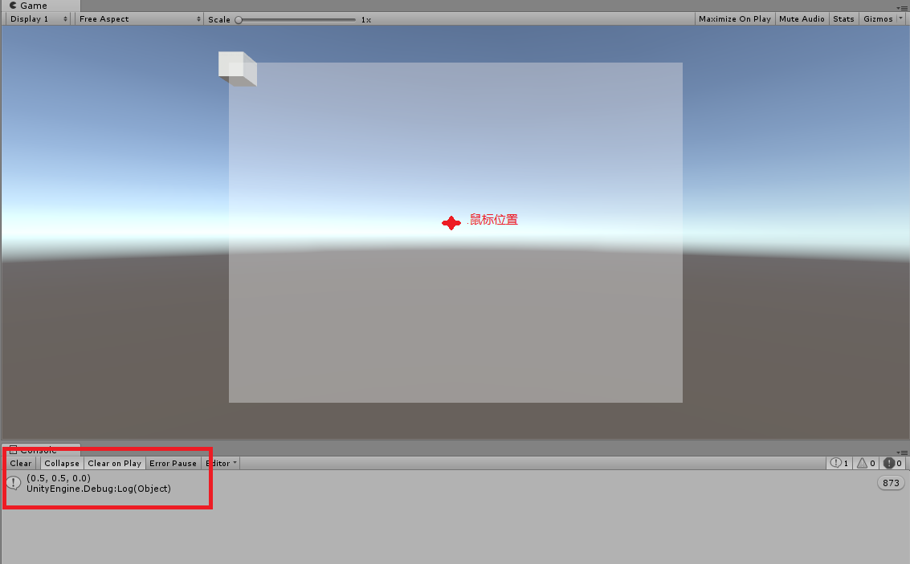
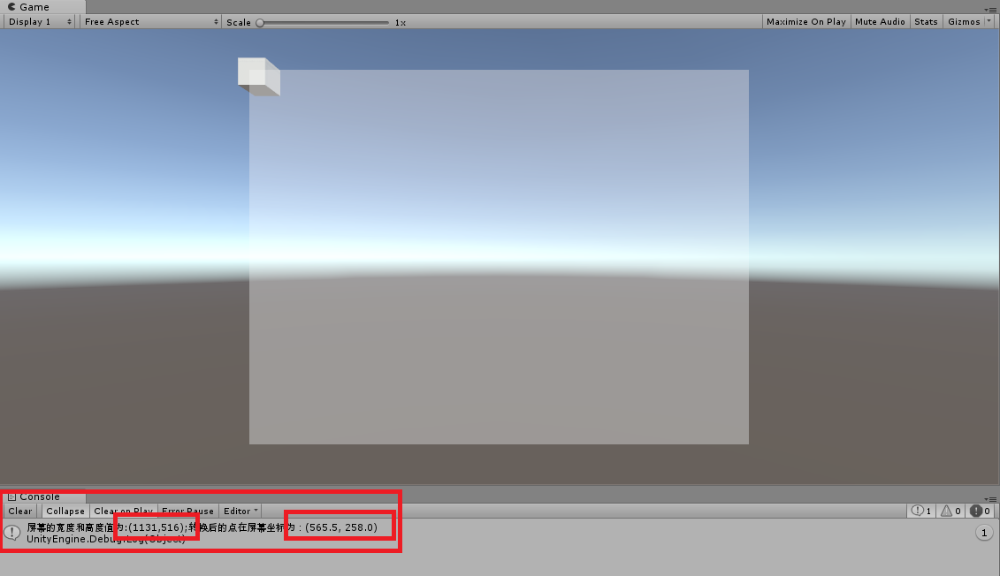
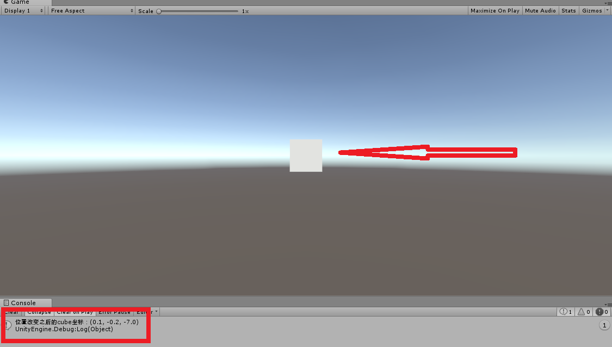

# 关于Unity中位置变化的总结
> 下面是我个人的理解 如果有什么问题欢迎指出

## 坐标系
首先需要明白的三个坐标系
* [屏幕坐标系(Screen)](#屏幕坐标系)
* [视口坐标系(Viewport)](#视口坐标系)
* [世界坐标系(World)](#世界坐标系)

### 屏幕坐标系
> 对于屏幕坐标系，首先我们需要明确的一点是，屏幕坐标系的取值范围，或者说它的数值是怎么定义的

#### 屏幕坐标
关于这点我们首先来看一下鼠标的位置信息，首先我们将它打印出来，如下图所示,由下图不难看出结果，从（493.0，205.0，0.0）中我们可以得出如下几个结论：
* 鼠标的位置坐标是按照屏幕像素点的坐标计算的
* 鼠标位置坐标默认只保留到小数点最后一位

在测试中我发现当鼠标点超出Game视图之后，它的坐标值也存在，只不过的是当超出左边框和下边框时候，它的值就变成负值（其实说这么多，最后你会发现鼠标的坐标位置是从屏幕坐标得出来的结果，这里只是假设不不知道的情况下）
```C#
Debug.Log(Input.mousePosition);
```
<div align="center">

</div>

接下来再来看看一个三维物体的世界坐标转换到屏幕坐标的结果，如下图代码部分，从下图中可以看出，打印出来的数值形式和上面一致。

**综上所述，屏幕坐标系就是以屏幕像素点来作为单位的，默认保留小数点后一位，且屏幕坐标系的原点是左下角，范围内的最大值点是右上角**
####### 代码1
```C#
//二维向量
pos_W_S = Camera.main.WorldToScreenPoint(transform.position);
Debug.Log(pos_W_S);
```
<div align="center">

</div>

### 视口坐标系
#### 世界坐标转视口坐标
> 视口坐标系，顾名思义就是我们相机的视口范围中的坐标系，三维相机其实是一个视锥体

从下图中可以看出，视口坐标系是一个三维的向量，它其实是代表一个物体相对于我们相机的视锥体的位置，如果在视锥体中，也就是相机能够看到这个物体的话，那么这个物体的视口坐标的x,y的值就是在0——1之间，z的值根据世界坐标系计算得出，如果相机看不到物体的话，那么它的x,y值将超出0——1的范围。

**视锥体坐标系是以我们当前相机的局部坐标系为准的，类比屏幕坐标系，视口坐标系，左下为（0，0），右上为（1，1）。其实可以这样认为，我们相机也就是一个物体，这个物体在世界坐标系中有它的位置，视口坐标系中的坐标，就是其他物体以相机为参考系，然后转换得到的新的坐标。**

```C#
//这是一个三维向量
pos_W_V = Camera.main.WorldToViewportPoint(transform.position);
Debug.Log($"视口坐标为：{pos_W_V}");
```
<div align="center">

</div>

#### 屏幕坐标转视口坐标
> 屏幕点转视口点默认的z坐标为0

屏幕坐标转视口坐标其实就是像我上面所说的那样，可以把屏幕当作视口的投影，屏幕是我们所看到的区域，当在屏幕中的时候，我们的点在视口中的范围就是（0，0）——（1，1）左下点到右上点，屏幕转视口坐标可以帮助我们将在屏幕上的操作转换到世界变换，这个后续会说到，如果直接屏幕转换到世界坐标系，这样往往是实现不了我们通过屏幕移动操作一个三维世界中的物体的，因为屏幕转世界坐标系通过Camera.main.ScreenToWorldPoint(Input.mousePosition)的这个方法最终只能得到此相机在三维世界中的位置，不能达到我们上面所说的效果。**测试可行的方式是屏幕点转视口点，让后再将视口点转到世界坐标系中，实现效果就是让一个物体在三维世界跟随鼠标的移动**
```c#
//屏幕转视口坐标
mouse_S_V = Camera.main.ScreenToViewportPoint(Input.mousePosition);
Debug.Log(mouse_S_V);
```
<div align="center">

</div>

#### 视口转屏幕坐标
下面看以下视口转屏幕后的坐标
```c#
//视口转屏幕坐标系
//假设视口坐标为（0.5，0.5，0）
Vector3 pos_V_S = new Vector3(0.5f,0.5f,0f);
Vector2 pos_S = Camera.main.ViewportToScreenPoint(pos_V_S);
//打印一下 看转换后的屏幕坐标是否为屏幕的中心
Debug.Log($"屏幕的宽度和高度值为:({Screen.width},{Screen.height});转换后的点在屏幕坐标为：{pos_S}");
```
最终结果和预期一样，转化的点在屏幕中心，z的值不会对转换的坐标有影响

<div align="center">

</div>


#### 视口转世界坐标
视口转换到世界坐标，可以方便的做出物体跟随鼠标移动的效果，保存物体从世界映射到视口坐标的向上的坐标值假如说是z，让后通过屏幕鼠标点映射到视口坐标，将x,y赋值给视口的x,y;然后将刚才得到的z三个值组合成一个三维向量，再转化到世界坐标，赋值给物体的transform.Postion

下面是使用的方法,可以看到Cube出现再屏幕中间位置
```c#
//视口转世界坐标
pos_V_S = new Vector3(0.5f,0.5f,8f);
Vector3 pos_W = Camera.main.ViewportToWorldPoint(pos_V_S);
//位置赋值给一个cube
transform.position = pos_W;
Debug.Log($"位置改变之后的cube坐标：{transform.position}" );
```
<div align="center">

</div>


### 世界坐标系

#### 世界坐标系转屏幕坐标系
这方便可以查看上面的[代码1](#代码1)

