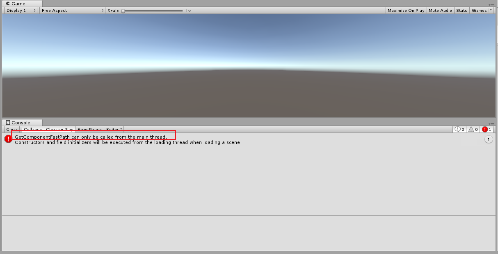
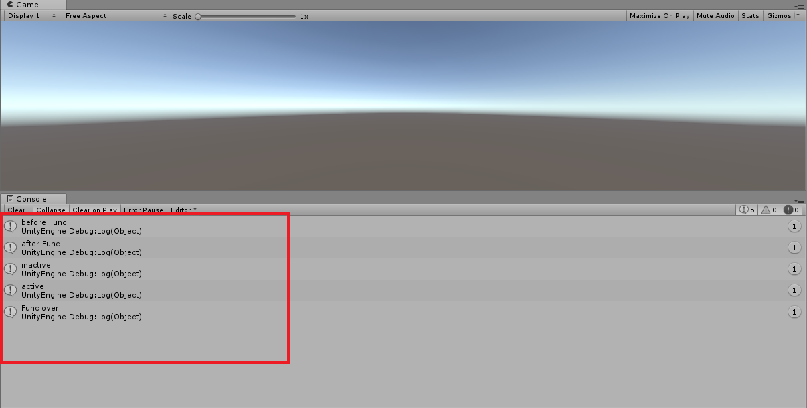
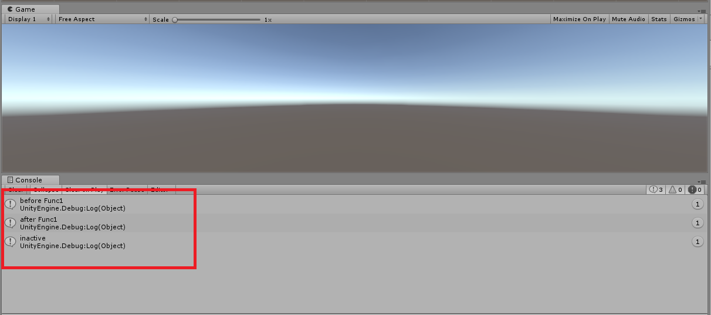

# 关于Unity中异步的使用小结
> 一般在Unity中我们实现异步调用的话，最多使用的是Coroutine,然而在C#的语法中提供了另一种解决方案，那就是async加await

## 认识一下async/await
> 知乎上的解释：[async/await](https://www.zhihu.com/question/56651792)

这两个关键词，async和await是c#新的语法糖，用来方便我们编写高并发的代码

## 异步与多线程
首先说说我自己的理解，异步和多线程一般用于做一件这样的事：“你现在正在干一件很重要的事，这时候突然需要你去执行另一个任务，然而你现在做的工作又不能停止，所以我们需要分配另一个人去干那个突如其来的任务”

## Unity中的异步和多线程
> 首先说明一下，由于Unity的脚本程序是单线程执行的，所以在另一个线程中不能调用继承MonoBehaviour的组件

看下面的一个例子

###### Thread实现
```C#
//通过Thread实现
Thread thread = new Thread(() =>
{
	GetComponent<Transform>().gameObject.SetActive(false);
});
thread.Start();
```
###### Task
```c#
//通过Task
Task task = new Task(() =>
{
	GetComponent<Transform>().gameObject.SetActive(false);
});
task.Start();
```
###### TaskFactory
```c#
//TaskFactory
TaskFactory factory = new TaskFactory();
Task task = factory.StartNew(() =>
{
    GetComponent<Transform>().gameObject.SetActive(false);
});
```
#### 以上都会出现下面的错误
从下图中我们可以看出，在Unity中其他线程的程序是不能访问Unity的组件的。
<div align="center">

</div>

#### 使用async/await访问
###### 调用部分
```c#
Debug.Log("before Func");
Func();
Debug.Log("after Func");
```
###### Func函数
```c#
public async void Func()
{

    await Task.Run(()=> { Thread.Sleep(2000);});
    GetComponent<Transform>().gameObject.SetActive(false);
    Debug.Log("inactive");
    await Task.Run(() => { Thread.Sleep(2000); });
    GetComponent<Transform>().gameObject.SetActive(true);
    Debug.Log("active");
    Debug.Log("Func over");
}
```
###### 执行结果
<div align="center">

</div>

#### 对比Coroutine实现
###### 调用
```c#
Debug.Log("before Func1");
StartCoroutine(Func1());
Debug.Log("after Func1");
```
###### Func1函数
```c#
public IEnumerator Func1()
{
    yield return new WaitForSeconds(2f);
    GetComponent<Transform>().gameObject.SetActive(false);
    Debug.Log("inactive");
    yield return new WaitForSeconds(2f);
    GetComponent<Transform>().gameObject.SetActive(true);
    Debug.Log("active");
    Debug.Log("Func1 over");
}
```
###### 执行结果
**从下图我们会发现一个奇怪的现象，怎么inactive后没有任何输出了呢，检查代码没有错误，我们在看看上面的图，使用async/await却能正常的执行后面的代码，这就是两者的却别所在。从本质上来说，在unity中，当一个物体变成了inactive，它上的代码也是不执行的，也就是GetComponent是不执行的（这里我们的代码就是放在这个测试物体上的），Unity中的Coroutine并没有错，而是我们需要在使用的时候注意这一点，而async/await为什么能够执行后面的代码呢，我猜测可能和async/await的语法糖背后的实现机制有关，查看了资料，最后大致了解到，当我们将一个方法标记成async方法的时候，它在执行到await的时候就返回调用了，然而await后面的逻辑是封装到一个代码块中的（语法糖背后的实现机制，有的解释是封装到IL的状态机中作为一个状态，所以相关的变量都被保存下来），等待await执行完成之后，便接着执行后续的代码块。**
<div align="center">

</div>

## 结尾
瞎琢磨\^O^,自己的一些理解


<div align="right">
随便写写，记录生活
<p>via Recho</p>
</div>
